# Task - Implement a Client Server Architecture using MySQL Database Management System (DBMS)

## The following instructions were followed to implement the above task:

### Step 1. Create and configure two linux-based virtual servers (EC2 instance in AWS)

- ```mysql server```
- ```mysql client```

__1.__ Two EC2 Instances of t2.micro type and Ubuntu 24.04 LTS (HVM) was lunched in the us-east-1 region using the AWS console.

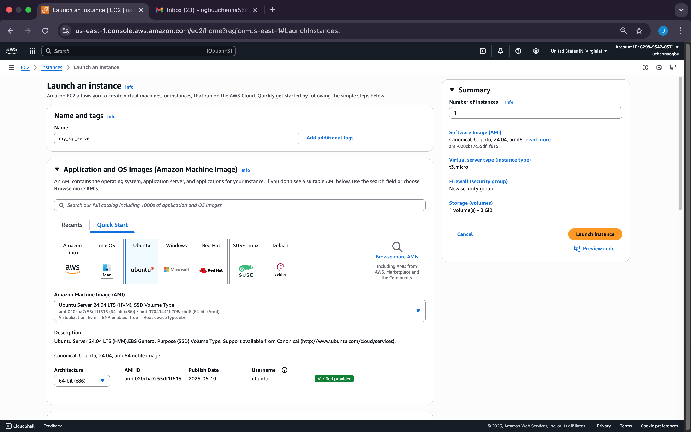

__mysql server__
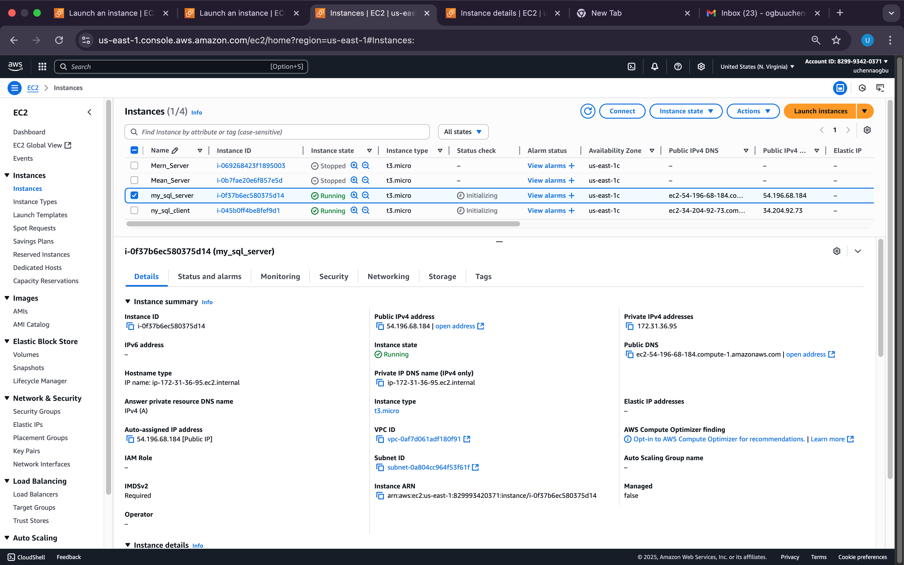

__mysql client__
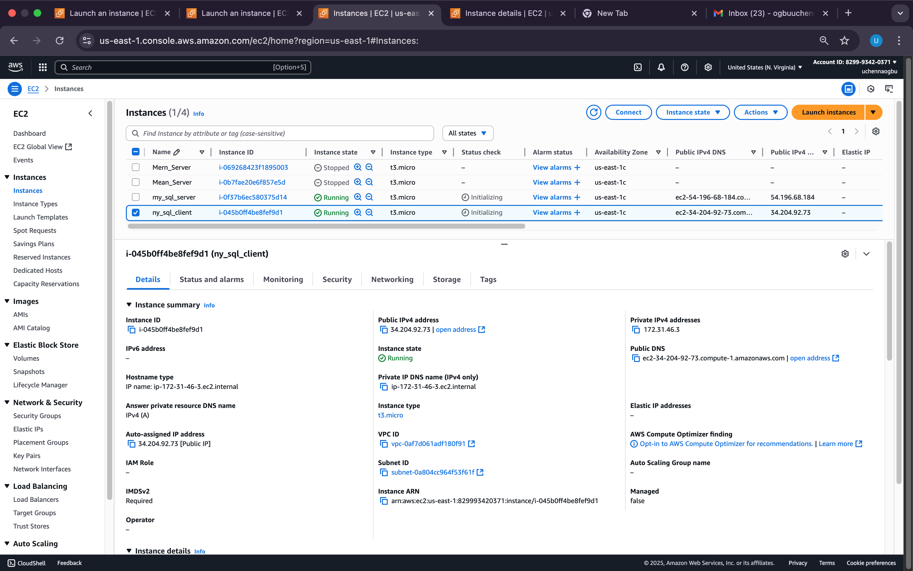

The security group inbound rule for both instances was configured with the default SSH on port 22 with source from anywhere.

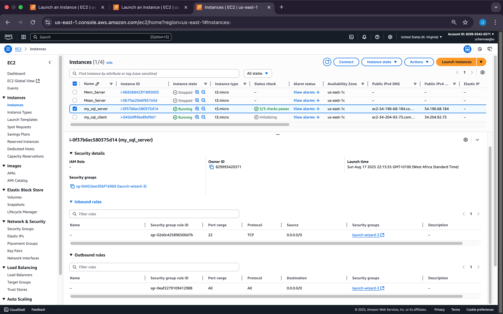
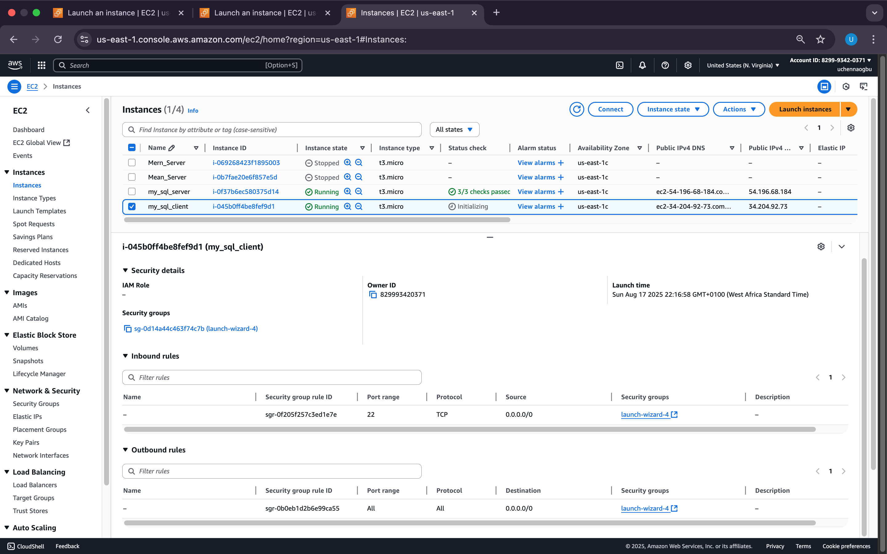

__2.__ Attached SSH key named __my-ec2-key__ to access the instance on port 22


## Step 2 - On ```mysql server``` Linux Server, install MySQL Server software

__1.__ The private ssh key permission was changed for the private key file and then used to connect to the instance by running

```bash
chmod 400 my_ec2_keypair.pem
```
```bash
ssh -i "my_ec2_keypair.pem" ubuntu@54.196.68.184
```
Where __username=ubuntu__ and __public ip address=54.196.68.184__


__2.__ __Update and upgrade Ubuntu__

```bash
sudo apt update && sudo apt upgrade -y
```


__3.__ __Install MySQL Server software__

```bash
sudo apt install mysql-server -y
```
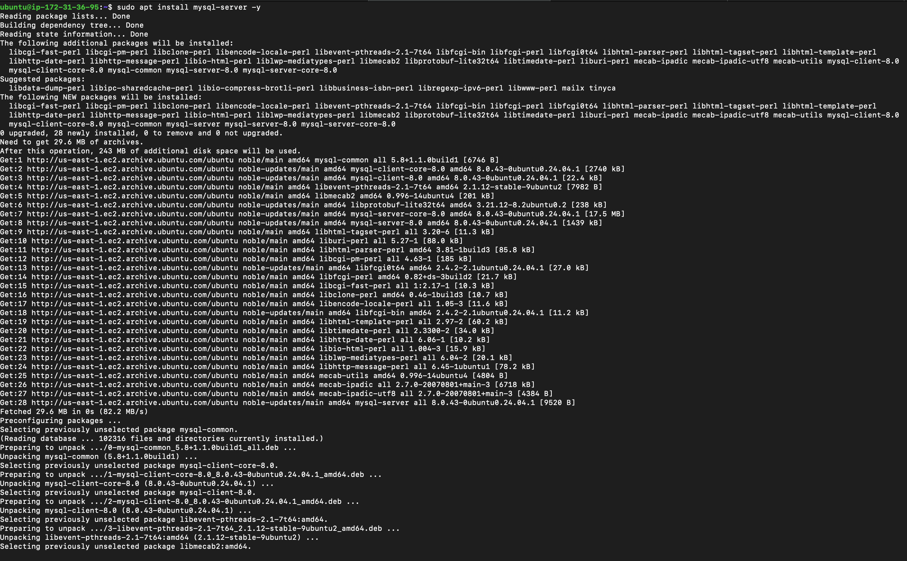

__4.__ __Enable mysql server__

```bash
sudo systemctl enable mysql
```
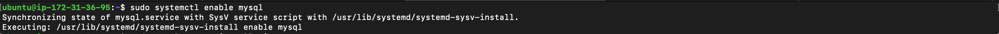


## Step 3 - On ```mysql client``` Linux Server install MySQL Client software.

__1.__ __Connect to the instance__

```bash
ssh -i "my-ec2-key.pem" ubuntu@34.204.92.73
```
Where __username=ubuntu__ and __public ip address=34.204.92.73__


__2.__ __Update and upgrade Ubuntu__

```bash
sudo apt update && sudo apt upgrade -y
```
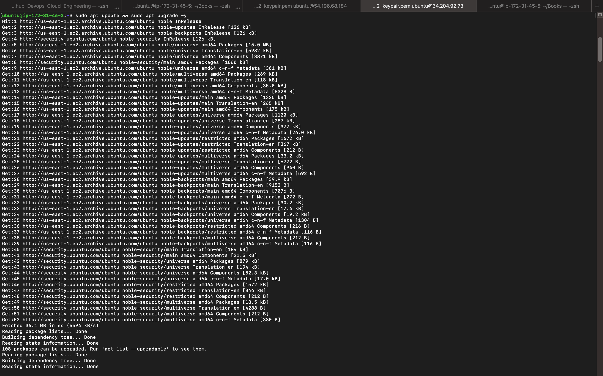

__3.__ __Install MySQL Client software__

```bash
sudo apt install mysql-client -y
```
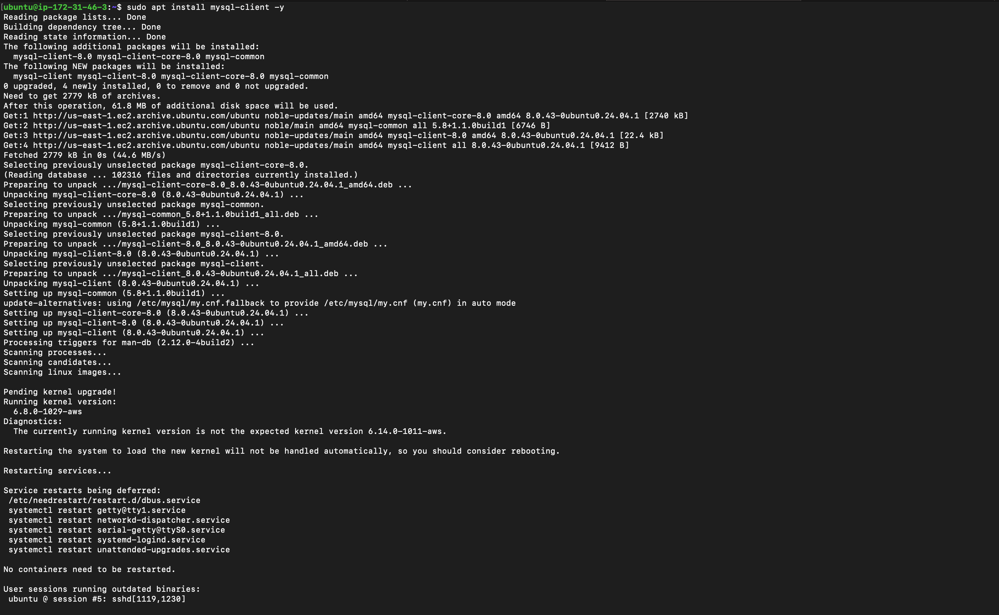


## Step 4 - Use ```mysql server's``` local IP address to connect from ```mysql client```.

By default, both of the EC2 virtual servers are located in the same local virtual network, so they can communicate to each other using __local IP addresses__. Use ```mysql server's``` local IP address to connect from ```mysql client```. MySQL server uses ```TCP port 3306``` by default so it has to be opened by creating a new entry in __inbound rules__ in __mysql server__ Security Groups.
For extra security, access to __mysql server__ by all IP addresses was not allowed, only the specific local IP address of __mysql client__ was allowed.

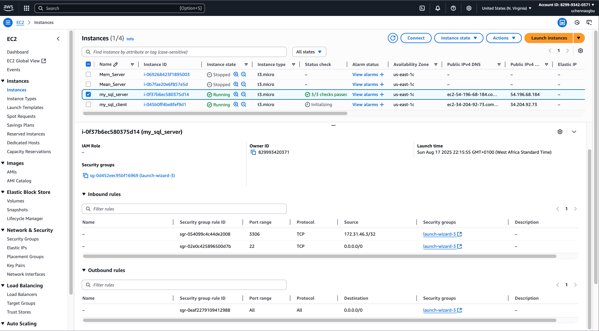


## Step 5 - Configure MySQL server to allow connections from remote hosts.

__Befor the configuration stated above, the following were implemented:__

__1.__ The security script of MySQL was run on __mysql server__ by running the command:

```bash
sudo mysql_secure_installation
```
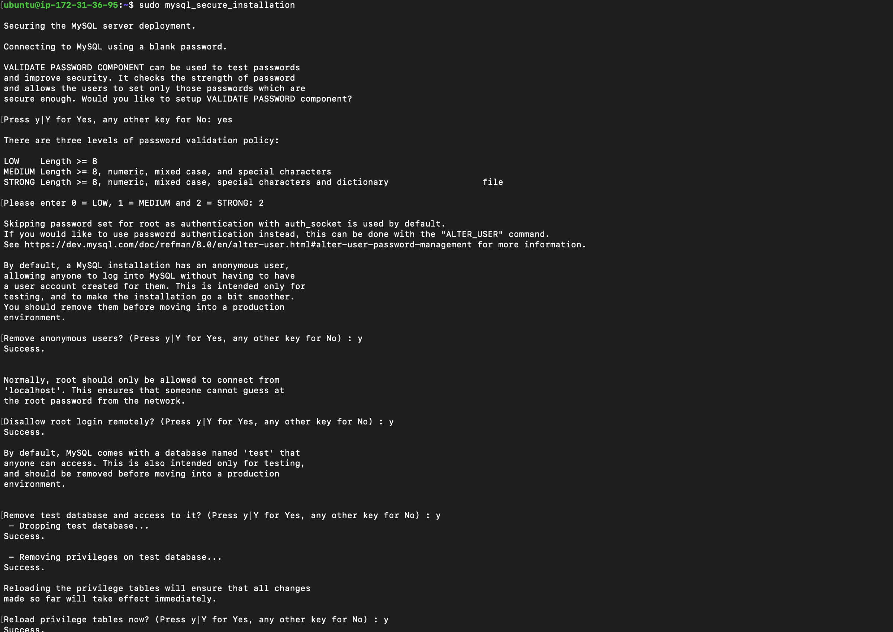

__2.__ __Access MySQL shell__

```bash
sudo mysql
```


__3.__ __On mysql server, create a user named ```client``` and a database named ```test_db```__.

```bash
CREATE USER 'client'@'%' IDENTIFIED WITH mysql_native_password BY 'User123$';

CREATE DATABASE test_db;

GRANT ALL ON test_db.* TO 'client'@'%' WITH GRANT OPTION;

FLUSH PRIVILEGES;
```


__4.__ __Now, configure MySQL server to allow connections from remote hosts__.

```bash
sudo vim /etc/mysql/mysql.conf.d/mysqld.cnf
```
Locate ```bind-address = 127.0.0.1```

Replace ```127.0.0.1``` with ```0.0.0.0```


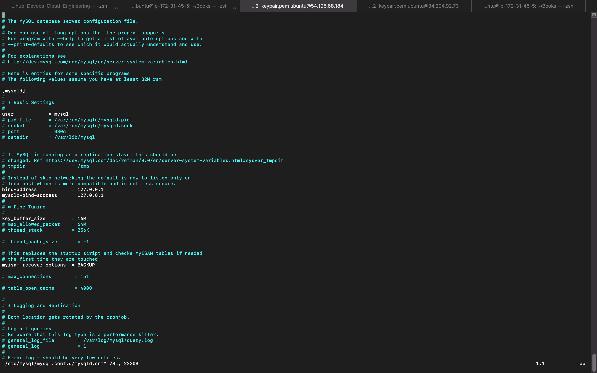


## Step 6 - From ```mysql client``` Linxus Sever, connect remotely to ```mysql server``` Database Engine without using SSH. The mysql utility must be used to perform this action.

```bash
sudo mysql -u client -h 172.31.18.141 -p
```
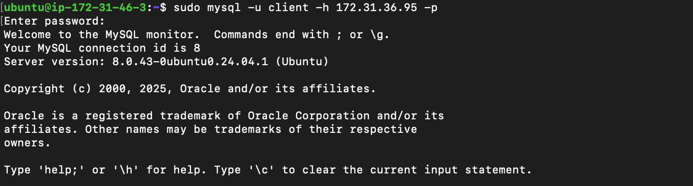


## Step 7 - Check that the connection to the remote MySQL server was successfull and can perform SQL queries.

```bash
show databases;
```


__Create table, insert rows into table and select from the table__

```bash
CREATE TABLE test_db.test_table (
  item_id INT AUTO_INCREMENT,
  content VARCHAR(255),
  PRIMARY KEY(item_id)
);

INSERT INTO test_db.test_table (content) VALUES ("My first choice football club is Chelsea");

INSERT INTO test_db.test_table (content) VALUES ("My second choice football club is R.Madrid");

SELECT * FROM test_db.test_table;
```

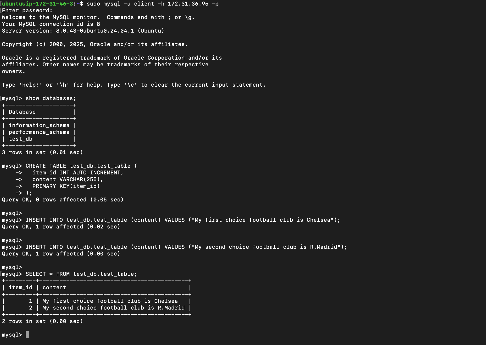


At this point, this project is successfully complete.
This deployment is a fully functional MySQL Client-Server set up.