## WEB STACK IMPLEMENTATION (LAMP STACK) IN AWS

### Introduction:

__The LAMP stack is an open-source web development platform that consists of four main components: Linux, Apache, MySQL, and PHP (or sometimes Perl or Python). This documentation outlines the setup, configuration, and usage of the LAMP stack.__

## Step 0: Prerequisites

__1.__ EC2 Instance of t3.micro type and Ubuntu 24.04 LTS (HVM) was launched in the eu-north-1b region using the AWS console.
t3.micro was used because t2.micro was not avialable in the region.


__2.__ Created SSH key pair named __my-lamp-key-pair__ to access the instance on port 22

__3.__ The security group was configured with the following inbound rules:

- Allow traffic on port 80 (HTTP) with source from anywhere on the internet.
- Allow traffic on port 443 (HTTPS) with source from anywhere on the internet.
- Allow traffic on port 22 (SSH) with source from any IP address. This is opened by default.

<!--  -->
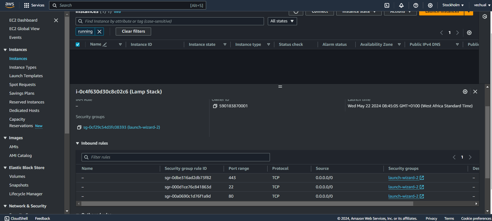


__4.__ The default VPC and Subnet was used for the networking configuration.

<!--  -->
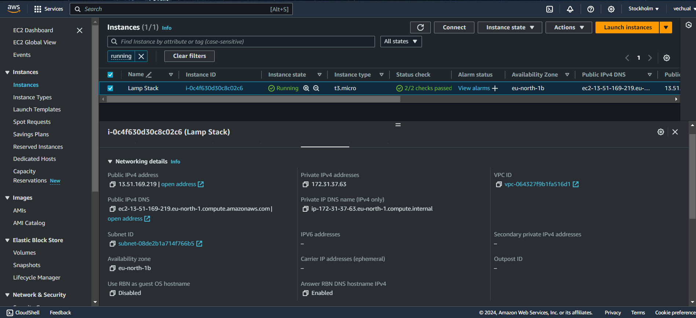


__5.__ The private ssh key that got downloaded was located, permission was changed for the private key file and then used to connect to the instance by running
```
chmod 400 my-key-pair.pem
```
```
ssh -i "my-key-pair.pem" ubuntu@13.51.169.219.eu-north-1.compute.amazonaws.com
```
Where __username=ubuntu__ and __public ip address=13.51.169.219__


## Step 1 - Install Apache and Update the Firewall

__1.__ __Update and upgrade list of packages in package manager__
```
sudo apt update
sudo apt upgrade -y
```

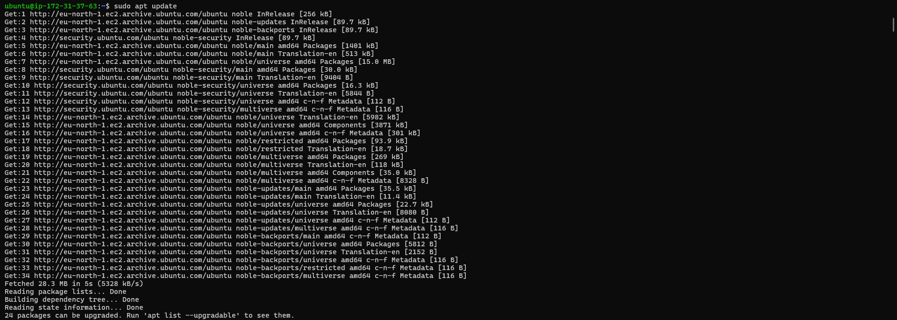
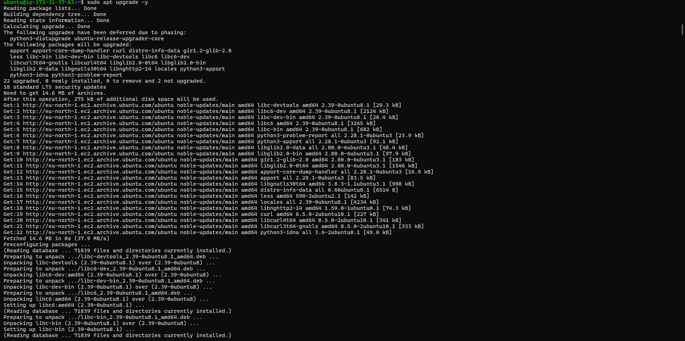

__2.__ __Run apache2 package installation__
```
sudo apt install apache2 -y
```
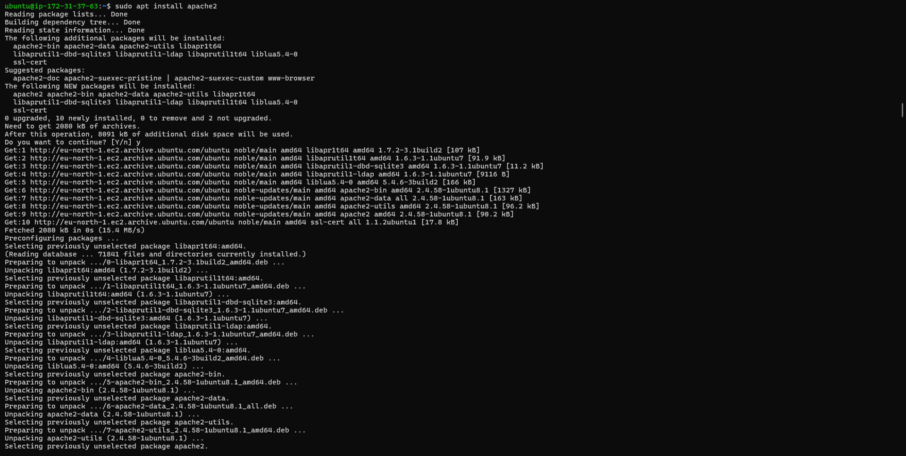

__3.__ __Enable and verify that apache is running on as a service on the OS.__
```
sudo systemctl enable apache2
sudo systemctl status apache2
```
Apache2 is correctly installed

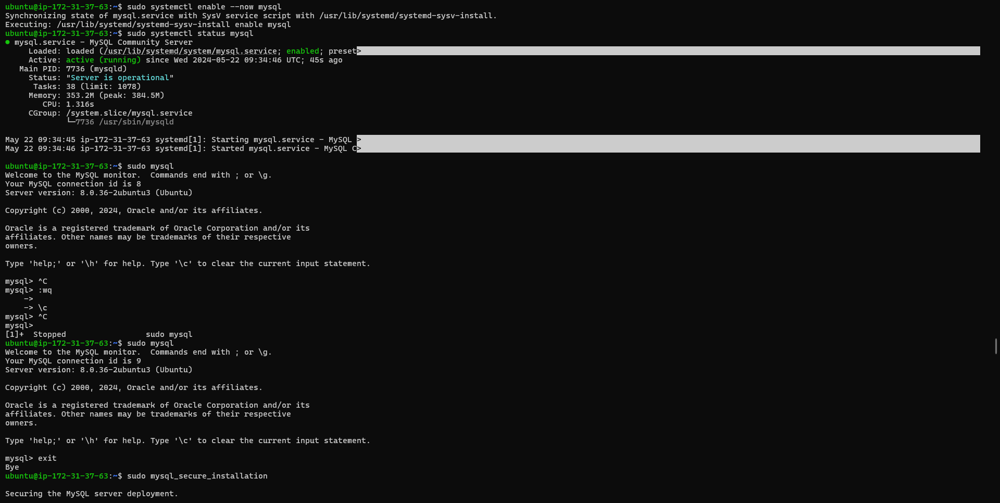

__4.__ __The server is running and can be accessed locally in the ubuntu shell by running the command below:__

```
curl http://localhost:80
OR
curl http://127.0.0.1:80
```

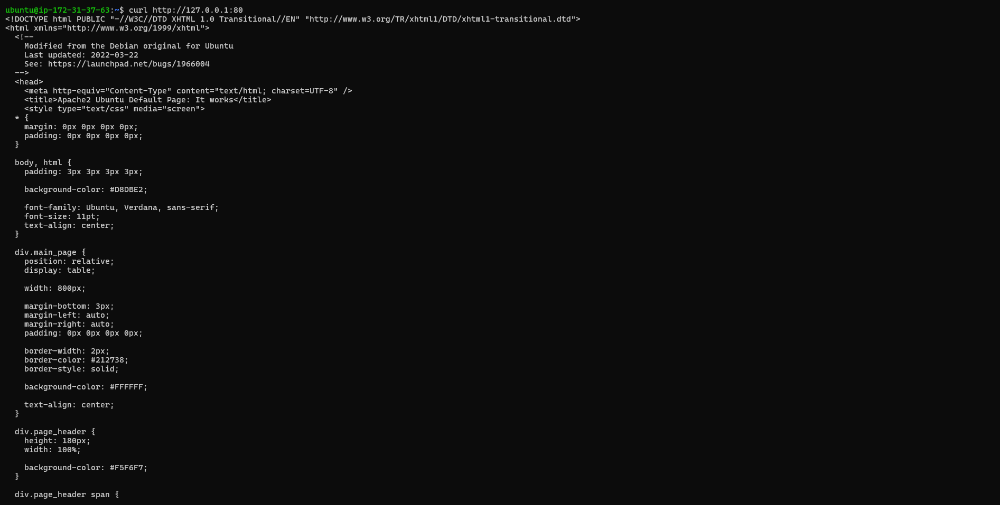

__5.__ __Test with the public IP address if the Apache HTTP server can respond to request from the internet using the url on a browser.__
```
http://13.51.169.219
```


This shows that the web server is correctly installed and it is accessible through the firewall.


## Step 2 - Install MySQL

__1.__ __Install a relational database (RDB)__

MySQL was installed in this project. It is a popular relational database management system used within PHP environments.
```
sudo apt install mysql-server
```

When prompted, install was confirmed by typing y and then Enter.

__2.__ __Enable and verify that mysql is running with the commands below__
```
sudo systemctl enable --now mysql
sudo systemctl status mysql
```


__3.__ __Log in to mysql console__
```
sudo mysql
```
This connects to the MySQL server as the administrative database user __root__ infered by the use of __sudo__ when running the command.

__4.__ __Set a password for root user using mysql_native_password as default authentication method.__

Here, the user's password was defined as "Admin123$"
```
ALTER USER 'root'@'localhost' IDENTIFIED WITH mysql_native_password BY 'Admin123$';
```
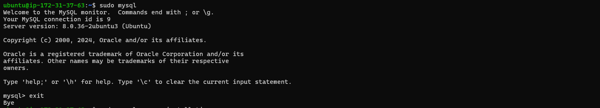
Exit the MySQL shell
```
exit
```

__5.__ __Run an Interactive script to secure MySQL__

The security script comes pre-installed with mysql. This script removes some insecure settings and lock down access to the database system.
```
sudo mysql_secure_installation
```
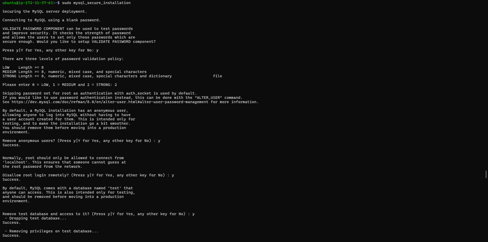

Regardless of whether the VALIDATION PASSWORD PLUGIN is set up, the server will ask to select and confirm a password for MySQL root user.

__6.__ __After changing root user password, log in to MySQL console.__

A command prompt for password was noticed after running the command below.
```
sudo mysql -p
```

```
exit
```

## Step 3 - Install PHP

__1.__ __Install php__
Apache is installed to serve the content and MySQL is installed to store and manage data.
PHP is the component of the set up that processes code to display dynamic content to the end user.

The following were installed:
- php package
- php-mysql, a PHP module that allows PHP to communicate with MySQL-based databases.
- libapache2-mod-php, to enable Apache to handle PHP files.
```
sudo apt install php libapache2-mod-php php-mysql
```
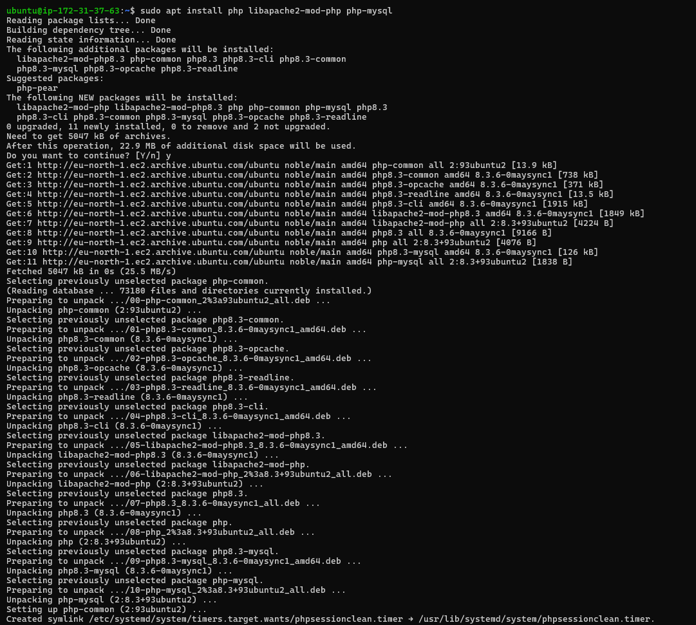

Confirm the PHP version
```
php -v
```

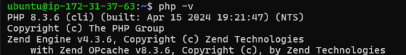
At this ponit, the LAMP stack is completely installed and fully operational.

To tset the set up with a PHP script, it's best to set up a proper Apache Virtual Host to hold the website files and folders. Virtual host allows to have multiple websites located on a single machine and it won't be noticed by the website users.

## Step 4 - Create a virtual host for the website using Apache

__1.__ __The default directory serving the apache default page is /var/www/html. Create your document directory next to the default one.__

Created the directory for projectlamp using "mkdir" command
```
sudo mkdir /var/www/projectlamp
```

__Assign the directory ownership with $USER environment variable which references the current system user.__
```
sudo chown -R $USER:$USER /var/www/projectlamp
```


__2.__ __Create and open a new configuration file in apache’s “sites-available” directory using vim.__
```
sudo vim /etc/apache2/sites-available/projectlamp.conf
```

Past in the bare-bones configuration below:
```
<VirtualHost *:80>
  ServerName projectlamp
  ServerAlias www.projectlamp
  ServerAdmin webmaster@localhost
  DocumentRoot /var/www/projectlamp
  ErrorLog ${APACHE_LOG_DIR}/error.log
  CustomLog ${APACHE_LOG_DIR}/access.log combined
</VirtualHost>
```
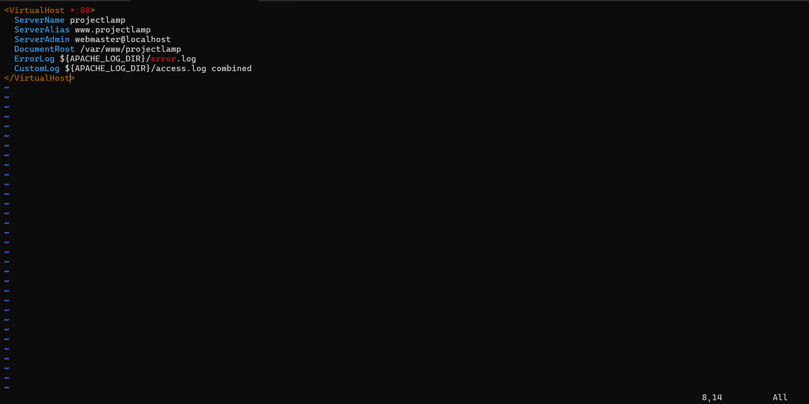


__3.__ __Show the new file in sites-available__
```
sudo ls /etc/apache2/sites-available
```
```
Output:
000-default.conf default-ssl.conf projectlamp.conf
```
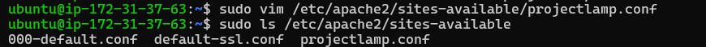

With the VirtualHost configuration, Apache will serve projectlamp using /var/www/projectlamp as its web root directory.

__4.__ __Enable the new virtual host__
```
sudo a2ensite projectlamp
```
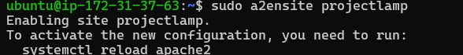

__5.__ __Disable apache’s default website.__

This is because Apache’s default configuration will overwrite the virtual host if not disabled. This is required if a custom domain is not being used.
```
sudo a2dissite 000-default
```
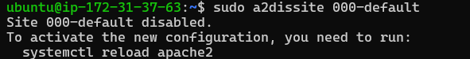

__6.__ __Ensure the configuration does not contain syntax error__

The command below was used:
```
sudo apache2ctl configtest
```
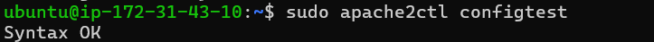

__7.__ __Reload apache for changes to take effect.__
```
sudo systemctl reload apache2
```


__8.__ __The new website is now active but the web root /var/www/projectlamp is still empty. Create an index.html file in this location so to test the virtual host work as expected.__
```
sudo echo 'Hello LAMP from hostname' $(curl -s http://169.254.169.254/latest/meta-data/public-hostname) 'with public IP' $(curl -s http://169.254.169.254/latest/meta-data/public-ipv4) > /var/www/projectlamp/index.html
```
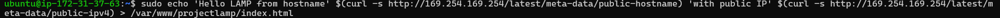


__9.__ __Open the website on a browser using the public IP address.__
```
http://13.51.169.219:80
```
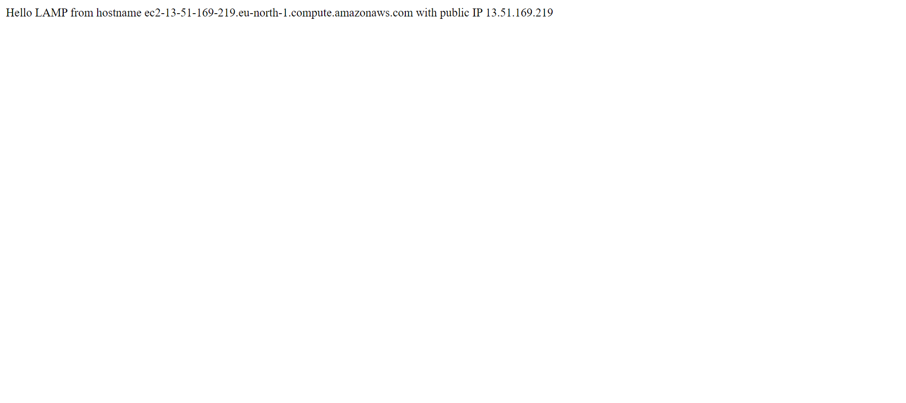

__10.__ Open the website with public dns name (port is optional)
```
http://<public-DNS-name>:80
```
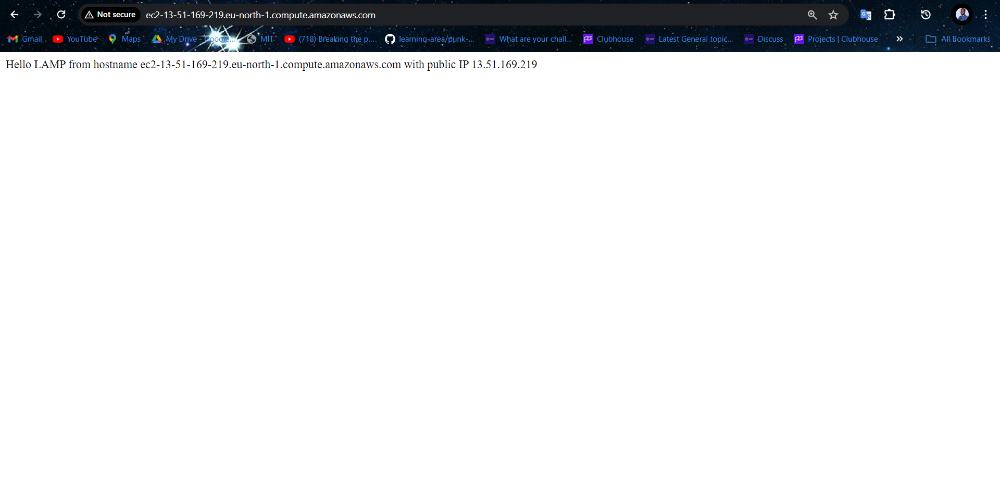

This file can be left in place as a temporary landing page for the application until an index.php file is set up to replace it. Once this is done, the index.html file should be renamed or removed from the document root as it will take precedence over index.php file by default.

## Step 5 - Enable PHP on the website

With the default DirectoryIndex setting on Apache, index.html file will always take precedence over index.php file. This is useful for setting up maintenance page in PHP applications, by creating a temporary index.html file containing an informative message for visitors. The index.html then becomes the landing page for the application. Once maintenance is over, the index.html is renamed or removed from the document root bringing back the regular application page.
If the behaviour needs to be changed, /etc/apache2/mods-enabled/dir.conf file should be edited and the order in which the index.php file is listed within the DirectoryIndex directive should be changed.

__1.__ __Open the dir.conf file with vim to change the behaviour__
```
sudo vim /etc/apache2/mods-enabled/dir.conf
```

```
<IfModule mod_dir.c>
  # Change this:
  # DirectoryIndex index.html index.cgi index.pl index.php index.xhtml index.htm
  # To this:
  DirectoryIndex index.php index.html index.cgi index.pl index.xhtml index.htm
</IfModule>
```
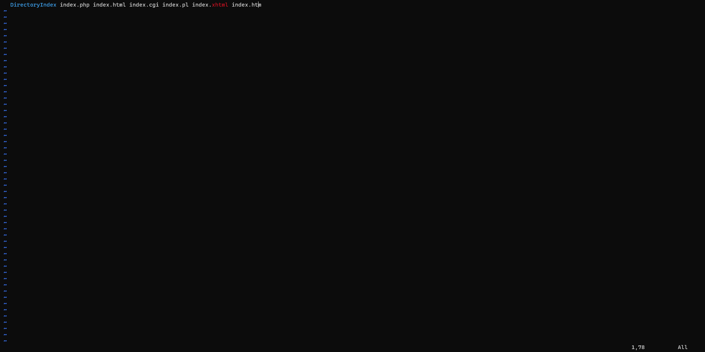


__2.__ __Reload Apache__

Apache is reloaded so the changes takes effect.
```
sudo systemctl reload apache2
```
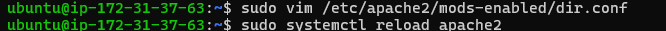

__3.__ __Create a php test script to confirm that Apache is able to handle and process requests for PHP files.__

A new index.php file was created inside the custom web root folder.

```
vim /var/www/projectlamp/index.php
```

__Add the text below in the index.php file__
```
<?php
phpinfo();
```

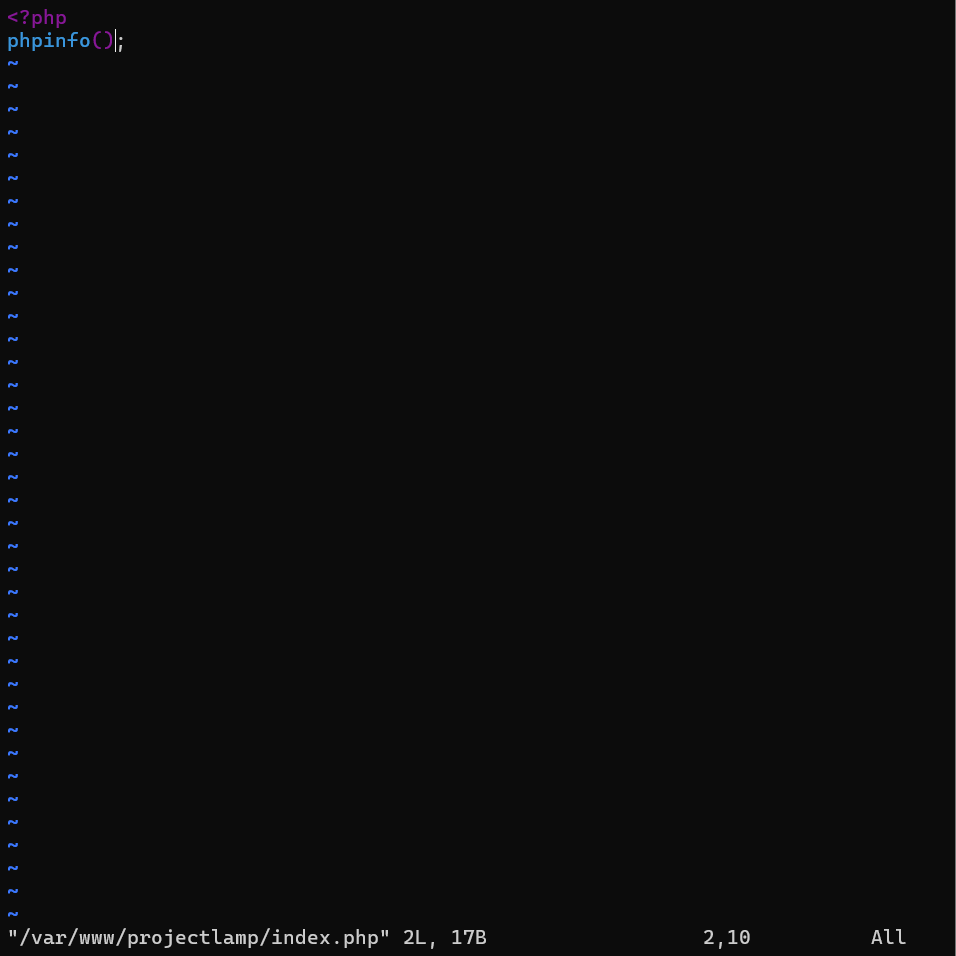


__4.__ __Now refresh the page__

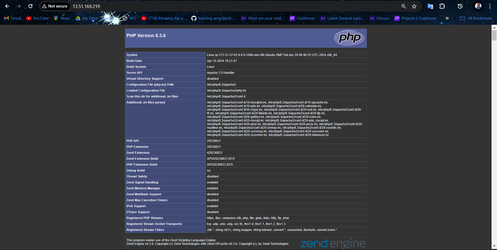

This page provides information about the server from the perspective of PHP. It is useful for debugging and to ensure the settings are being applied correctly.

After checking the relevant information about the server through this page, It’s best to remove the file created as it contains sensitive information about the PHP environment and the ubuntu server. It can always be recreated if the information is needed later.
```
sudo rm /var/www/projectlamp/index.php
```


__Conclusion:__

The LAMP stack provides a robust and flexible platform for developing and deploying web applications. By following the guidelines outlined in this documentation, It was possible to set up, configure, and maintain a LAMP environment effectively, enabling the creation of powerful and scalable web solutions.


